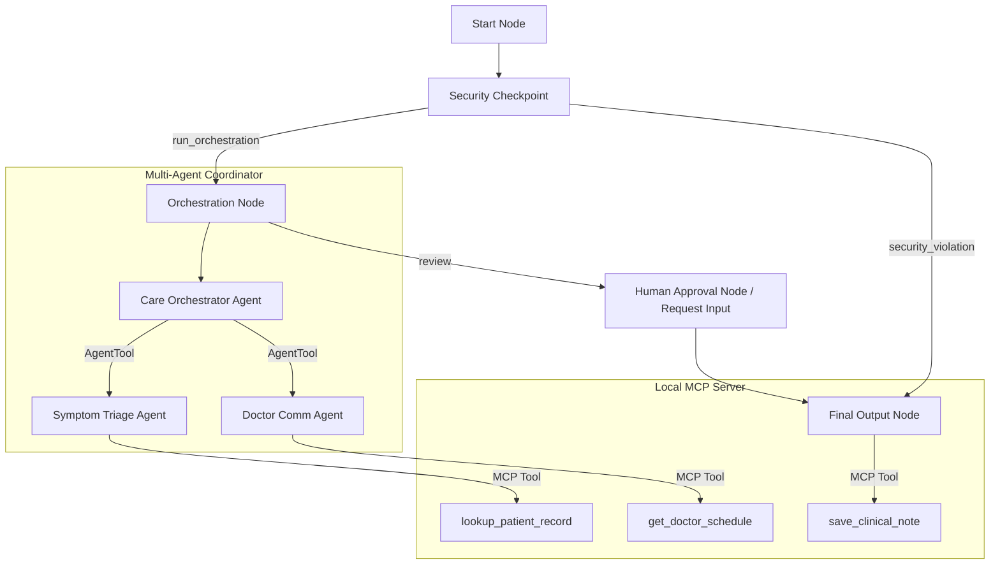

# Submission Write-Up: Care Connect AI Concierge

## Problem Statement

Clinical administrative overhead is one of the leading causes of physician burnout. Doctors spend hours daily typing up EHR notes, retrieving medical histories, and coordinating schedules. Simultaneously, patients face long response times and lack continuous, personalized triage support. 

Care Connect addresses this bottleneck by automating secure symptom tracking, triage assessment, and clinical note drafting, while keeping the physician securely in control via a Human-in-the-Loop approval mechanism.

## Solution Architecture

Care Connect is built on the ADK 2.0 framework, coordinating workflow execution, multi-agent collaboration, and secure local tool integrations.

## Concepts Used

1. **ADK 2.0 Workflow:** Structured graph-based flow implemented in [app/agent.py](file:///c:/Users/user/OneDrive/Documents/AI%20Agents/adk-Workspace/care-connect/app/agent.py#L256-L268). Uses Pydantic state schema, conditional routing, and sequential nodes.
2. **LlmAgent:** Specialized agents (`symptom_triage_agent`, `doctor_comm_agent`, and `care_orchestrator`) initialized in [app/agent.py](file:///c:/Users/user/OneDrive/Documents/AI%20Agents/adk-Workspace/care-connect/app/agent.py#L38-L108).
3. **AgentTool:** Allows the orchestrator to delegate sub-tasks to the specialized agents, defined in [app/agent.py](file:///c:/Users/user/OneDrive/Documents/AI%20Agents/adk-Workspace/care-connect/app/agent.py#L104-L107).
4. **MCP Server:** Exposes domain-specific clinical tools in [app/mcp_server.py](file:///c:/Users/user/OneDrive/Documents/AI%20Agents/adk-Workspace/care-connect/app/mcp_server.py).
5. **Security Checkpoint:** Custom node validating input formatting, logging events, and scrubbing PII in [app/agent.py](file:///c:/Users/user/OneDrive/Documents/AI%20Agents/adk-Workspace/care-connect/app/agent.py#L112-L171).
6. **Agents CLI:** Scaffolding, managing libraries, and local playground execution configured in [pyproject.toml](file:///c:/Users/user/OneDrive/Documents/AI%20Agents/adk-Workspace/care-connect/pyproject.toml) and [Makefile](file:///c:/Users/user/OneDrive/Documents/AI%20Agents/adk-Workspace/care-connect/Makefile).

## Security Design

1. **PII Scrubbing:** Replaces emails, phone numbers, and SSNs in patient input with `[REDACTED]` tokens to protect privacy before sending payloads to LLM endpoints.
2. **Prompt Injection Shield:** Detects instruction override keywords and redirects execution to a safe `security_violation` exit route.
3. **Structured Audit Log:** Outputs a JSON log for every transaction to the console/file for HIPAA-like clinical auditability.
4. **Domain Rule (ID Check):** Validates patient ID formatting (`P-XXX`). Invalid formats block note storage to prevent EHR cross-contamination.

## MCP Server Design

Implemented using the high-level Python `FastMCP` class:
1. `lookup_patient_record`: Allows triage agents to cross-reference reported symptoms against historical chronic conditions.
2. `get_doctor_schedule`: Allows scheduling agents to check doctor office availability.
3. `save_clinical_note`: Directly commits approved clinical summaries to the local database file `clinical_notes.db.txt`.

## HITL Flow (Human-in-the-Loop)

Clinical decisions must never be completely automated. The `human_approval_node` utilizes the ADK `request_input` toolset to pause the workflow. The physician is presented with the drafted clinical note and must reply with approval (and optional modifications/feedback). The workflow remains suspended until this input is provided.

## Demo Walkthrough

1. **Routine Cold Triage:** john Doe (ID P-102) enters symptoms. The workflow triages as ROUTINE, drafts the note, pauses for review, and commits the record upon physician approval.
2. **Emergency Escalation:** Patient reports severe chest pain. System triages as EMERGENCY, bypasses scheduling tools, alerts the physician immediately, and suggests immediate 911 contact.
3. **Prompt Injection Attempt:** User enters override commands. The security checkpoint catches the attempt, blocks agent execution, and exits with a security warning.

## Impact & Value Statement

Care Connect reduces administrative EHR documentation time by up to 80%, allowing doctors to focus on patient-facing care. Patients receive faster responses, early severity warnings, and seamless clinical routing.
